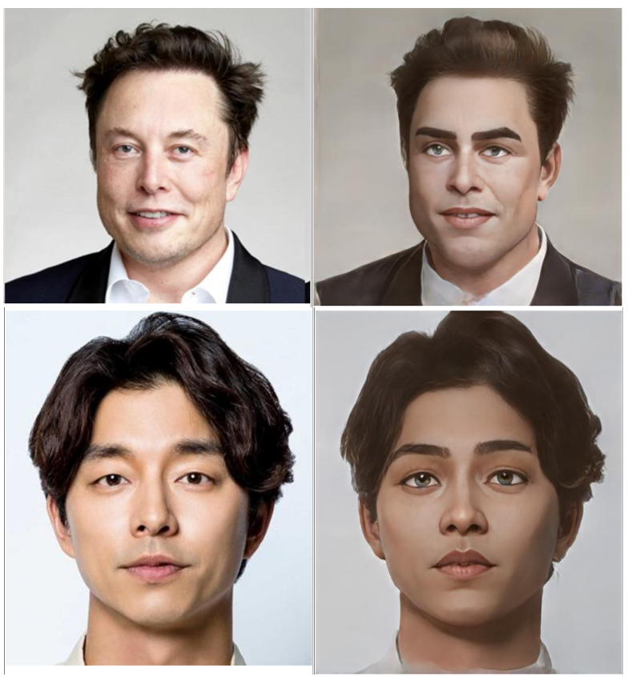

# Anime Style Transfer

Anime Style Transfer with Pytorch

- StyleGAN2(Blending)
- pix2pixHD

### 1. Prepare custom data

```
# video

ffmpeg -i video.mp4 -filter:v fps=0.5 video%d.jpg
```

### 2. Face Detection with YOLOv5

- [YOLOv5](https://github.com/ultralytics/yolov5)

**Custom Training with icartoonface dataset**

- [iCartoon](https://github.com/luxiangju-PersonAI/iCartoonFace)

- icartoonface format -> yolov5 format
    + Reference : `icartoonface_convert.ipynb`

- train yolov5

- detect + crop

```python
count = 0
for name in tqdm(os.listdir(folder)):
    img_path = os.path.join(folder, name)
    img = cv2.imread(img_path)
    img_h, img_w, _= img.shape
    
    results = model(img_path)
    
    for rst in results.crop():

        xmin, ymin, xmax, ymax = rst['box']

        xmin = int(xmin.cpu().numpy() * 0.92)
        xmax = int(xmax.cpu().numpy() * 1.08)
        ymin = int(ymin.cpu().numpy() * 0.92)
        ymax = int(ymax.cpu().numpy() * 1.08)

        if (xmax - xmin) > (ymax - ymin):
            ymax += (((xmax - xmin) - (ymax - ymin)) // 2)
            ymin -= (((xmax - xmin) - (ymax - ymin)) // 2)
        else:
            xmax += (((ymax - ymin) - (xmax - xmin)) // 2)
            xmin -= (((ymax - ymin) - (xmax - xmin)) // 2)

        xmax = min(xmax, img_w) 
        ymax = min(ymax, img_h) 
        xmin = max(xmin, 0) 
        ymin = max(ymin, 0) 

        cv2.imwrite(f'./result/{count}.png', img[ymin:ymax, xmin:xmax])
        count += 1
```

### 3. Remove Blurred Images with CLIP

- [CLIP](https://github.com/openai/CLIP)

```python
["clear face", "blurred face"]
```

### 4. Image Super-Resoultion with Waifu2x

- [Waifu2x](https://github.com/nagadomi/waifu2x)

### 5. Face Alignment according to FFHQ standard

- [FFHQ](https://github.com/NVlabs/ffhq-dataset)

### 6. Train StyleGAN2

- [StyleGAN2](https://github.com/NVlabs/stylegan2-ada-pytorch)

```
python dataset_tool.py --source=[YOUR DATASET PATH] --dest=./anime.zip
```

```sh
python train.py --outdir=./training-runs --data=./anime.zip --cfg=paper512 --mirror=1 --gpus=4 --batch 8 --resume ffhq512
```

### 7. Blend Model

- [StyleGAN2](https://github.com/NVlabs/stylegan2-ada-pytorch)

- Reference : `./blending.ipynb`

### 8. Pix2Pix Training

- [Pix2PixHD](https://github.com/NVIDIA/pix2pixHD)

```
# train

python train.py --name anime --dataroot ./datasets/anime --loadSize 512 --label_nc 0 --no_instance


# test

python test.py --name anime --dataroot ./datasets/test --loadSize 512 --label_nc 0 --no_instance
```

### Result





## Reference

- [https://github.com/bryandlee/animegan2-pytorch](https://github.com/bryandlee/animegan2-pytorch)
- [https://github.com/Sxela/ArcaneGAN](https://github.com/Sxela/ArcaneGAN)